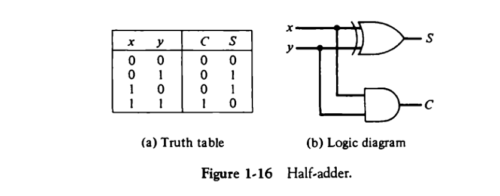
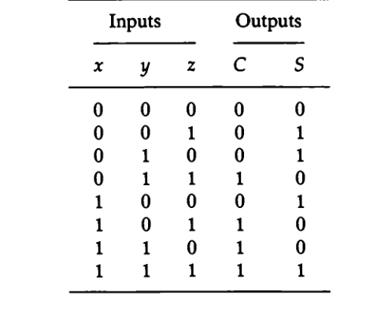

* Digital Computers
* Logic Gates, Boolean Algebra
* Map Simplifications
* Combinational Circuits
* Flip-Flops
* Sequential Circuits
* Integrated Circuits
* Decoders
* Multiplexers
* Registers and Counters
* Memory Unit.

## **Digital Computers**

A **digital computer** is an electronic machine that processes information using binary (0s and 1s). It consists of:

* **Central Processing Unit (CPU):** Controls operations and executes instructions.
* **Memory (RAM, ROM):** Stores data and programs.
* **Input/Output (I/O) Devices:** Communicates with external devices.
* **Bus System:** Transfers data between components.

A digital computer works on binary arithmetic and logic operations, making **digital logic circuits** fundamental to its operation.

***

## **Logic Gates**

Logic gates are the basic building blocks of digital circuits. They process binary signals (0 and 1) based on Boolean algebra.


### **Basic Gates:**

| Gate | Symbol | Operation                              |
| ---- | ------ | -------------------------------------- |
| AND  | ∧      | Output is 1 if both inputs are 1       |
| OR   | ∨      | Output is 1 if at least one input is 1 |
| NOT  | ¬      | Inverts the input (0 → 1, 1 → 0)       |

### **Universal Gates:**

* **NAND (NOT AND):** Output is 0 only if both inputs are 1.
* **NOR (NOT OR):** Output is 1 only if both inputs are 0.
* **XOR (Exclusive OR):** Output is 1 if inputs are different.
* **XNOR (Exclusive NOR):** Output is 1 if inputs are the same.

*NAND and NOR gates are universal because all logic circuits can be built using only them.*

***

## **3. Boolean Algebra**

Boolean algebra simplifies digital circuits using logical operations:

* **Idempotent Law:** A + A = A, A · A = A
* **Complement Law:** A + A' = 1, A · A' = 0
* **De Morgan’s Theorem:**
  * (A · B)' = A' + B'
  * (A + B)' = A' · B'

Boolean algebra helps in **simplifying logic circuits** by reducing the number of gates.

Absolutely! Let's stick with the **"light switch" + kid-friendly style** to explain these three important concepts in **Boolean Algebra**.

***

## **Idempotent Law:**

### "Doing it twice is the same as doing it once."

### 1. `A + A = A`

Imagine you have a switch **A**.\
If you say **“If A is ON OR A is ON”**, that’s still just **A is ON**.

🧠 You're not making it any more ON by repeating it.

| A | A + A |
| - | ----- |
| 0 | 0     |
| 1 | 1     |

### 2. `A · A = A`

This is like saying **“A AND A”** — which is still just A.

🧠 If the same switch is needed twice to turn on the light, it's no different from needing it once.

| A | A · A |
| - | ----- |
| 0 | 0     |
| 1 | 1     |

***

## **Complement Law:**

### "A and its opposite always cancel out."

### 1. `A + A' = 1`

This is like saying:

💡 "If switch A is ON OR switch A is OFF, will the light turn ON?"\
Yes! One of them **has to be true**.

| A | A' | A + A' |
| - | -- | ------ |
| 0 | 1  | 1      |
| 1 | 0  | 1      |

### 2. `A · A' = 0`

💡 "If switch A is ON **AND** A is OFF at the same time?"\
That can **never happen** — it's a contradiction. So the light is OFF.

| A | A' | A · A' |
| - | -- | ------ |
| 0 | 1  | 0      |
| 1 | 0  | 0      |

***

## **De Morgan’s Theorem:**

### "Flip the group, change AND to OR (or OR to AND)."

This is a **magic trick** to simplify logic when there’s a **NOT** outside a group.

### 1. `(A · B)' = A' + B'`

Say:\
“If both A AND B need to be ON for light, and I say NO to that, what’s actually happening?”\
👉 You’re saying: “Either A is OFF OR B is OFF”

| A | B | A·B | (A·B)' | A' | B' | A'+B' |
| - | - | --- | ------ | -- | -- | ----- |
| 0 | 0 | 0   | 1      | 1  | 1  | 1     |
| 0 | 1 | 0   | 1      | 1  | 0  | 1     |
| 1 | 0 | 0   | 1      | 0  | 1  | 1     |
| 1 | 1 | 1   | 0      | 0  | 0  | 0     |

✅ Left and right sides match!

***

### 2. `(A + B)' = A' · B'`

“If A OR B turns the light ON, and I say NO to that, it means BOTH A and B must be OFF.”

| A | B | A+B | (A+B)' | A' | B' | A'·B' |
| - | - | --- | ------ | -- | -- | ----- |
| 0 | 0 | 0   | 1      | 1  | 1  | 1     |
| 0 | 1 | 1   | 0      | 1  | 0  | 0     |
| 1 | 0 | 1   | 0      | 0  | 1  | 0     |
| 1 | 1 | 1   | 0      | 0  | 0  | 0     |

✅ Both sides match again!

***

## **4. Map Simplifications (Karnaugh Map - K-Map)**

A **K-map** is a visual method of simplifying Boolean expressions by grouping adjacent 1s in a **truth table**.

* Uses **2, 3, 4, or more variables**.
* Groups **1s in powers of 2** (1, 2, 4, 8).
* Reduces complex logic functions into minimal SOP (Sum of Products) or POS (Product of Sums) form.

Example:

```
  AB | 00 | 01 | 11 | 10 |
 --- |----|----|----|----|
   0 |  0 |  1 |  1 |  0 |
   1 |  1 |  1 |  0 |  0 |
```

Groups: (A'B) + (AB')

Result: A ⊕ B (XOR Gate)

***

## **5. Combinational Circuits**

Combinational circuits **do not** store past inputs (no memory). Their output depends only on the current inputs.

**Examples:**

1. **Half Adder** – Adds two binary digits (A, B)
   * Sum (S) = A ⊕ B
   * Carry (C) = A · B



1. **Full Adder** – Adds three binary digits (A, B, Carry-in)
   * Sum (S) = A ⊕ B ⊕ Cin
   * Carry (Cout) = A · B + Cin (A ⊕ B)



1. **Subtractor:** Performs binary subtraction using XOR, AND, and NOT gates.

2. **Multiplexer (MUX):** Selects one input from multiple inputs based on a selector.
   * 2:1 MUX: **Y = S' A + S B**

3. **Demultiplexer (DEMUX):** Sends one input to multiple outputs.

***

## **6. Flip-Flops (Sequential Circuits)**

Flip-flops are **memory elements** that store **one bit**. They are the building blocks of **registers and counters**.

### **Types of Flip-Flops:**

| Type         | Symbol | Function                                          |
| ------------ | ------ | ------------------------------------------------- |
| SR Flip-Flop | S-R    | Stores data based on Set (S) and Reset (R) inputs |
| D Flip-Flop  | D      | Stores input D at clock pulse                     |
| JK Flip-Flop | J-K    | Eliminates indeterminate state of SR flip-flop    |
| T Flip-Flop  | T      | Toggles between 0 and 1                           |

Example: **D Flip-Flop Truth Table**

| D | Q(next) |
| - | ------- |
| 0 | 0       |
| 1 | 1       |

Clocked Flip-Flops are used in **counters, registers, and memory units.**

***

## **7. Integrated Circuits (ICs)**

Integrated Circuits combine multiple logic gates on a chip.

### **IC Classifications:**

1. **SSI (Small Scale Integration)** – Few gates (AND, OR, XOR)
2. **MSI (Medium Scale Integration)** – Adders, Decoders, Multiplexers
3. **LSI (Large Scale Integration)** – Processors, Memory Chips
4. **VLSI (Very Large Scale Integration)** – Microprocessors, FPGAs

VLSI circuits power **modern CPUs, GPUs, and embedded systems**.

***

## **8. Decoders**

A **decoder** converts binary inputs into a single active output.\
Example: **2-to-4 Decoder**

| A | B | Output |
| - | - | ------ |
| 0 | 0 | 0001   |
| 0 | 1 | 0010   |
| 1 | 0 | 0100   |
| 1 | 1 | 1000   |

* Used in **memory address decoding**.

***

## **9. Multiplexers**

A **multiplexer (MUX)** selects one input from many based on control lines.

Example: **4-to-1 MUX**\
**Y = A S0' S1' + B S0 S1' + C S0' S1 + D S0 S1**

* Used in **data routing and CPU registers**.

***

## **10. Registers and Counters**

A **register** is a group of flip-flops used for **temporary storage** of data in CPUs.

* **Shift Registers:** Shift data left or right (used in serial communication).
* **Parallel Registers:** Store multiple bits at once.

A **counter** is a register that increments or decrements values based on clock pulses.

### **Types of Counters:**

1. **Asynchronous Counter** – Ripple effect (slower)
2. **Synchronous Counter** – All flip-flops triggered at the same time (faster)
3. **Up/Down Counter** – Counts up or down based on control input
4. **Ring Counter** – Circular shift of bits

***

## **11. Memory Unit**

A **memory unit** stores and retrieves data in a digital system.

### **Types of Memory:**

1. **Primary Memory (RAM, ROM)** – Fast, volatile (RAM), non-volatile (ROM)
2. **Cache Memory** – Small, fast memory between CPU and RAM
3. **Secondary Memory (HDD, SSD)** – Stores permanent data
4. **Registers** – High-speed temporary storage in CPU

Memory is organized as **word addressable** or **byte addressable**.

***
